# 8-Puzzle Visualizer

## 1. Mục tiêu

Dự án **8-Puzzle Visualizer** được xây dựng nhằm cung cấp một công cụ trực quan hóa và tương tác với các thuật toán giải bài toán 8-puzzle – một bài toán kinh điển trong lĩnh vực Trí tuệ Nhân tạo (AI). Đây là một ứng dụng kết hợp giữa học thuật và thực hành, giúp người dùng, đặc biệt là sinh viên và người học AI, hiểu rõ cách các thuật toán hoạt động trong việc giải quyết bài toán trạng thái một cách tối ưu. Dự án không chỉ dừng lại ở mô phỏng thuật toán mà còn tạo ra một giao diện trực quan giúp người dùng nhập liệu, theo dõi và phân tích từng bước giải.

### 1.1 Giáo dục và hỗ trợ học tập
- Trực quan hóa quá trình hoạt động của các thuật toán tìm kiếm như A*, BFS, DFS, Q-Learning và nhiều thuật toán khác. Người dùng có thể quan sát cách thuật toán mở rộng trạng thái, đánh giá chi phí, và lựa chọn hướng đi tối ưu trong không gian trạng thái.
- So sánh hiệu suất giữa các thuật toán dựa trên thời gian thực thi và số lần mở rộng trạng thái, từ đó cung cấp góc nhìn thực tế về hiệu quả của từng phương pháp khi giải quyết cùng một bài toán.

### 1.2 Tăng tính tương tác và trải nghiệm người dùng
- Cung cấp giao diện người dùng thân thiện, cho phép người dùng tự nhập trạng thái bắt đầu và đích, chọn thuật toán giải, điều chỉnh tốc độ mô phỏng, và xuất kết quả ra file CSV. Giao diện hỗ trợ tương tác trực tiếp để người dùng dễ dàng thử nghiệm và học hỏi.
- Hình ảnh động minh họa (GIF) cho từng thuật toán giúp tăng cường khả năng hình dung và phân tích từng bước thực hiện.

### 1.3 Ứng dụng thực tế của trí tuệ nhân tạo
- Các thuật toán triển khai trong dự án đều là nền tảng trong AI, được ứng dụng trong các lĩnh vực như lập kế hoạch, giải quyết bài toán tổ hợp, tối ưu hóa, và học máy. Dự án giúp người học nhận thức rõ hơn về cách các giải thuật hoạt động và tiềm năng ứng dụng trong thực tế.

### 1.4 Kết hợp giữa lý thuyết và thực hành
- Bằng cách tích hợp nhiều nhóm thuật toán AI khác nhau (tìm kiếm, CSP, local search, reinforcement learning...), dự án không chỉ mang tính minh họa lý thuyết mà còn là công cụ thực hành hữu ích. Người dùng có thể quan sát, điều chỉnh và kiểm thử để hiểu sâu hơn về đặc điểm và hành vi của từng thuật toán trong các tình huống cụ thể.

## 2. Nội dung

### 2.1. Các thuật toán tìm kiếm không có thông tin (Uninformed Search)

#### Thành phần chính của bài toán 8-Puzzle

1. **Trạng thái ban đầu (Initial State):**
    - Là một hoán vị hợp lệ của các số từ 0 đến 8, được biểu diễn dưới dạng tuple 1 chiều gồm 9 phần tử, tương ứng với ma trận 3x3. Ví dụ: (2, 6, 5, 0, 8, 7, 4, 3, 1).
2. **Trạng thái mục tiêu (Goal State):**
    - Trạng thái cần đạt đến, thường được định nghĩa là (1, 2, 3, 4, 5, 6, 7, 8, 0) – các số được sắp xếp tăng dần và ô trống ở vị trí cuối cùng.
3. **Không gian trạng thái (State Space):**
    - Bao gồm tất cả các trạng thái có thể đạt được từ trạng thái ban đầu thông qua các hành động hợp lệ (di chuyển ô trống). Tổng số trạng thái tối đa là 9! = 362,880.
4. **Tập hợp các hành động (Actions):**
    - Di chuyển ô trống (0) theo bốn hướng (nếu hợp lệ):
        - Di chuyển lên.
        - Di chuyển xuống.
        - Di chuyển sang trái.
        - Di chuyển sang phải.
5. **Hàm chuyển đổi (Transition Function):**
    - Từ trạng thái hiện tại:
        - Tìm vị trí của ô trống.
        - Kiểm tra các hướng có thể di chuyển dựa trên vị trí đó.
        - Thực hiện di chuyển để tạo ra trạng thái mới bằng cách hoán đổi vị trí 0 với các ô kế bên.
6. **Hàm chi phí (Cost Function):**
    - Mỗi hành động di chuyển có chi phí bằng 1. Tổng chi phí là số bước đi từ trạng thái ban đầu đến trạng thái mục tiêu. Được sử dụng trong thuật toán UCS để tối ưu hóa tổng chi phí di chuyển (Tuy nhiên với bài toán này sẽ không thấy rõ được điểm mạnh UCS bởi chi phí luôn là 1).

#### Thuật toán và cách tiếp cận giải pháp
1. **BFS (Breadth-First Search):**
    - **Cách hoạt động**
        - Sử dụng hàng đợi FIFO để duyệt theo mức, mở rộng các trạng thái theo chiều rộng trước.
        - Luôn duyệt trạng thái có ít bước nhất từ đầu đến hiện tại.
    - **Ưu điểm**
        - Tìm được lời giản ngắn nhất (ít bước nhất).
        - Đơn giản, dễ cài đặt.
    - **Kết quả trả về**
        - Danh sách các trạng thái từ trạng thái ban đầu đến trạng thái đích và số bước di chuyển.

    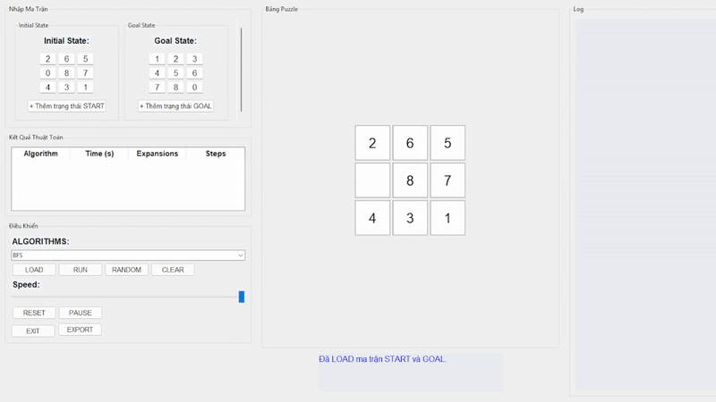

2. **DFS (Depth-First Search):**
    - **Cách hoạt động**
        - Sử dụng ngăn xếp LIFO để duyệt theo nhánh sâu nhất trước.
        - Đi sâu vào một nhánh cho đến khi không thể đi tiếp, sau đó mới quay lại nhánh khác.
    - **Ưu điểm**
        - Tốn ít bộ nhớ hơn BFS.
        - Nhanh nếu lời giải gần gốc.
    - **Nhược điểm**
        - Không đảm bảo tìm được lời giải ngắn nhất.
        - Dễ bị kẹt ở các nhánh sâu vô tận nếu không giới hạn độ sâu.
    - **Kết quả trả về**
        - Danh sách các trạng thái từ trạng thái ban đầu đến trạng thái đích và số bước di chuyển.   

    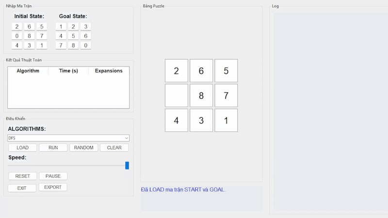

3. **UCS (Uniform-Cost Search):**
    - **Cách hoạt động**
        - Sử dụng hàng đợi ưu tiên dựa theo tổng chi phí (g(n)).
        - Mỗi bước mở rộng trạng thái có chi phí thấp nhất trước.
    - **Ưu điểm**
        - Tìm được đường đi rẻ nhất về chi phí (nếu chi phí di chuyển khác nhau).
        - Tương tự BFS nếu mọi hành động đều có chi phí = 1.
    - **Nhược điểm**
        - Tốn nhiều tài nguyên hơn BFS.
    - **Kết quả trả về**
        - Đường đi có chi phí thấp nhất từ trạng thái ban đầu đến mục tiêu.

    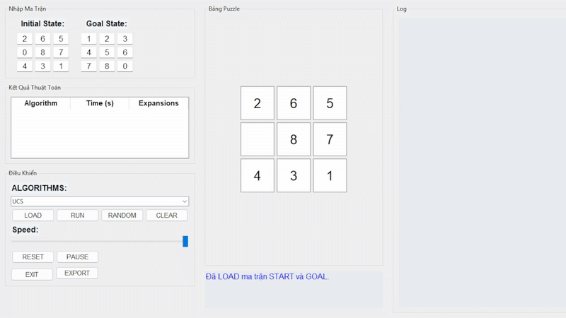

4. **Iterative Deepening DFS (IDDFS):**
    - **Cách hoạt động**
        - Kết hợp DFS và BFS bằng cách lặp DFS với độ sâu tăng dần.
        - Giúp tránh kẹt ở nhánh vô tận của DFS.
    - **Ưu điểm**
        - Cân bằng giữa BFS (chính xác) và DFS (bộ nhớ).
    - **Nhược điểm**
        - TChạy lại DFS nhiều lần nên mất thời gian khi giới hạn độ sâu chưa đủ.
    - **Kết quả trả về**
        - Danh sách các trạng thái từ trạng thái ban đầu đến trạng thái đích và số bước di chuyển.   

    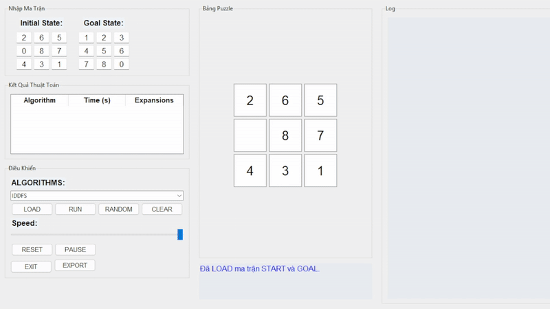

#### Giải pháp (Solution)
- **Định nghĩa:**
    - Một lời giải là chuỗi các trạng thái từ ban đầu đến mục tiêu, cùng danh sách các hành động và tổng chi phí (số bước).
- **Kết quả:**
    - Nếu tìm được trạng thái mục tiêu:
        - Trả về các trạng thái trung gian, hành động tương ứng, và tổng số bước.
    - Nếu không tìm thấy:
        - Trả về thông báo không có lời giải.
#### So sánh thuật toán
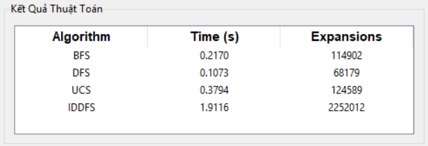
#### Nhận xét
- **BFS:** Phù hợp cho bài toán yêu cầu tìm đường ngắn nhất nhưng có thể tốn nhiều bộ nhớ.
- **DFS:** Phù hợp cho bài toán nhỏ, không gian trạng thái hạn chế, nhưng không đảm bảo tối ưu.
- **UCS:** Đảm bảo tối ưu về chi phí, nhưng đòi hỏi nhiều tài nguyên hơn BFS.
- **IDDFS** Cân bằng giữa BFS và DFS, nhưng lại có gây trễ do phải lặp lại nhiều lần.

### 2.2. Các thuật toán tìm kiếm có thông tin (Informed Search)

#### Thành phần chính của bài toán 8-Puzzle

1. **Trạng thái ban đầu (Initial State):**
    - Là một hoán vị hợp lệ của các số từ 0 đến 8, được biểu diễn dưới dạng tuple 1 chiều gồm 9 phần tử, tương ứng với ma trận 3x3. Ví dụ: (2, 6, 5, 0, 8, 7, 4, 3, 1).
2. **Trạng thái mục tiêu (Goal State):**
    - Trạng thái cần đạt đến, thường được định nghĩa là (1, 2, 3, 4, 5, 6, 7, 8, 0) – các số được sắp xếp tăng dần và ô trống ở vị trí cuối cùng.
3. **Không gian trạng thái (State Space):**
    - Bao gồm tất cả các trạng thái có thể đạt được từ trạng thái ban đầu thông qua các hành động hợp lệ (di chuyển ô trống). Tổng số trạng thái tối đa là 9! = 362,880.
4. **Tập hợp các hành động (Actions):**
    - Di chuyển ô trống (0) theo bốn hướng (nếu hợp lệ):
        - Di chuyển lên.
        - Di chuyển xuống.
        - Di chuyển sang trái.
        - Di chuyển sang phải.
5. **Hàm chuyển đổi (Transition Function):**
    - Từ trạng thái hiện tại:
        - Tìm vị trí của ô trống.
        - Kiểm tra các hướng có thể di chuyển dựa trên vị trí đó.
        - Thực hiện di chuyển để tạo ra trạng thái mới bằng cách hoán đổi vị trí 0 với các ô kế bên.
6. **Hàm heuristic (Heuristic Function):**
    - Được sử dụng để ước lượng khoảng cách còn lại từ trạng thái hiện tại đến trạng thái mục tiêu. Dự án sử dụng:
        - Manhattan Distance – Tổng khoảng cách theo chiều ngang và dọc từ vị trí hiện tại của mỗi ô số đến vị trí đích của nó trong trạng thái mục tiêu.
    - Cách sử dụng của từng thuật toán:
        - A*: Kết hợp cả chi phí thực tế (`g`) và khoảng cách ước lượng (`h`) để tối ưu hóa tìm kiếm với công thức `f(n) = g(n) + h(n).`
        - Greedy Best-First Search (GBFS): Chỉ sử dụng giá trị ước lượng (`h`) để mở rộng trạng thái gần mục tiêu nhất, để tìm đường nhanh nhất.
        - IDA*: Áp dụng giống A*, nhưng thực hiện duyệt sâu có giới hạn trên f(`n`), giúp tiết kiệm bộ nhớ hơn.
7. **Hàm chi phí (Cost Function):**
    - Mỗi hành động có chi phí = 1.
    - `g(n)`: Tổng chi phí từ trạng thái ban đầu đến trạng thái hiện tại.
    - `f(n) = g(n) + h(n)`: Tổng chi phí bao gồm cả chi phí thực tế và chi phí ước lượng.

#### Thuật toán và cách tiếp cận giải pháp
1. **Greedy Best-First Search (GBFS):**
    - **Cách hoạt động:**
        - Sử dụng hàng đợi ưu tiên (Priority Queue) dựa trên giá trị heuristic `h(n)`.
        - Chọn trạng thái gần mục tiêu nhất theo ước lượng.
    - **Ưu điểm:**
        - Chạy nhanh, không cần duy trì chi phí g(n).
    - **Nhược điểm:**
        - Không đảm bảo lời giải ngắn nhất do chỉ quan tâm đến mục tiêu, bỏ qua chi phí đã đi.
    - **Kết quả trả về:**
        - Đường đi từ trạng thái ban đầu đến mục tiêu dựa trên ước lượng tốt nhất.

    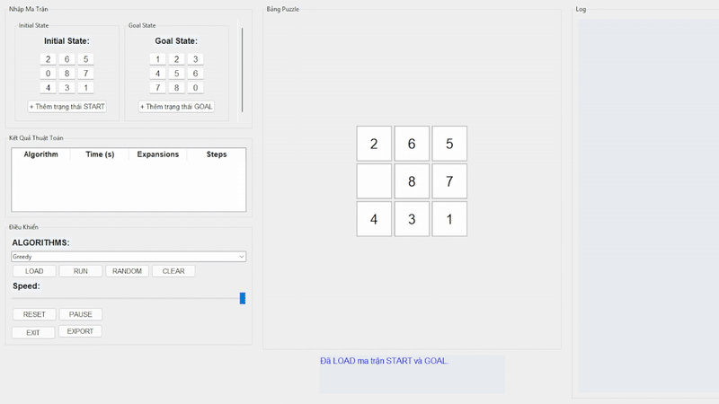
2. **A Search (A-Star):**
    - **Cách hoạt động:**
        - Sử dụng hàng đợi ưu tiên (Priority Queue) và kết hợp giữa chi phí đã đi (g(n)) và khoảng cách ước lượng còn lại (h(n)) để làm tiêu chí ưu tiên.
    - **Ưu điểm:**
        - Đảm bảo tìm được lời giải tối ưu nếu h(n) là heuristic chấp nhận được (admissible).
    - **Nhược điểm:**
        - Tốn nhiều bộ nhớ khi không gian trạng thái lớn.
    - **Kết quả trả về:**
        - Đường đi từ trạng thái ban đầu đến mục tiêu dựa trên ước lượng tốt nhất.

    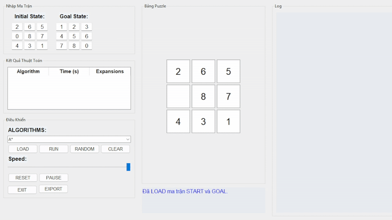
3. **Iterative Deepening A (IDA):**
    - **Cách hoạt động:**
        - Kết hợp giữa A* và DFS bằng cách duyệt sâu có giới hạn theo ngưỡng f(n).
        - Mỗi lần tăng ngưỡng f và lặp lại đến khi tìm được lời giải.
    - **Ưu điểm:**
        - Giảm bộ nhớ đáng kể so với A*.
    - **Nhược điểm:**
        - Mỗi vòng lặp có thể phải duyệt lại các trạng thái trước đó, gây tốn thời gian.
    - **Kết quả trả về:**
        - Đường đi tối ưu như A*, nhưng sử dụng ít tài nguyên hơn.

    

#### Giải pháp (Solution)
- **Định nghĩa:**
    - Một lời giải là chuỗi các trạng thái từ ban đầu đến mục tiêu, cùng danh sách các hành động và tổng chi phí (số bước).
- **Kết quả:**
    - Nếu tìm được trạng thái mục tiêu:
        - Trả về các trạng thái trung gian, hành động tương ứng, và tổng số bước.
    - Nếu không tìm thấy:
        - Trả về thông báo không có lời giải.

#### So sánh thuật toán
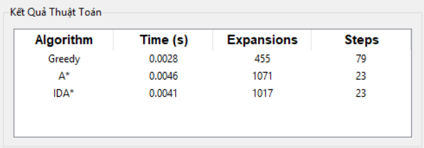

#### Nhận xét
- **A* Search:** Phù hợp cho bài toán yêu cầu tìm đường ngắn nhất và tối ưu, nhưng yêu cầu bộ nhớ cao.
- **GBFS:** Chạy nhanh hơn, phù hợp với bài toán không cần đảm bảo tối ưu về đường đi.
- **IDA*:** Đường đi tối ưu và sử dụng ít bộ nhớ, nhưng lại chạy chậm hơn A*.

### 2.3. Các thuật toán tìm kiếm cục bộ (Local Search)

#### Thành phần chính của bài toán 8-Puzzle

1. **Trạng thái ban đầu (Initial State):**
    - Là một hoán vị hợp lệ của các số từ 0 đến 8, được biểu diễn dưới dạng tuple 1 chiều gồm 9 phần tử, tương ứng với ma trận 3x3. Ví dụ: (2, 6, 5, 0, 8, 7, 4, 3, 1).
2. **Trạng thái mục tiêu (Goal State):**
    - Trạng thái cần đạt đến, thường được định nghĩa là (1, 2, 3, 4, 5, 6, 7, 8, 0) – các số được sắp xếp tăng dần và ô trống ở vị trí cuối cùng.
3. **Không gian trạng thái (State Space):**
    - Bao gồm tất cả các trạng thái có thể đạt được từ trạng thái ban đầu thông qua các hành động hợp lệ (di chuyển ô trống). Tổng số trạng thái tối đa là 9! = 362,880.
4. **Tập hợp các hành động (Actions):**
    - Di chuyển ô trống (0) theo bốn hướng (nếu hợp lệ):
        - Di chuyển lên.
        - Di chuyển xuống.
        - Di chuyển sang trái.
        - Di chuyển sang phải.
5. **Hàm chuyển đổi (Transition Function):**
    - Từ trạng thái hiện tại:
        - Tìm vị trí của ô trống.
        - Kiểm tra các hướng có thể di chuyển dựa trên vị trí đó.
        - Thực hiện di chuyển để tạo ra trạng thái mới bằng cách hoán đổi vị trí 0 với các ô kế bên.
6. **Hàm heuristic (Heuristic Function):**
    - Được sử dụng để ước lượng khoảng cách còn lại từ trạng thái hiện tại đến trạng thái mục tiêu. Dự án sử dụng:
        - Manhattan Distance – Tổng khoảng cách theo chiều ngang và dọc từ vị trí hiện tại của mỗi ô số đến vị trí đích của nó trong trạng thái mục tiêu.
    - Cách sử dụng của từng thuật toán:
        - Simple Hill Climbing: Tìm trạng thái kế cận có giá trị heuristic tốt hơn (nhỏ hơn).
        - Steepest-Ascent Hill Climbing: Duyệt toàn bộ các trạng thái kế cận và chọn trạng thái có giá trị heuristic nhỏ nhất trong số đó.
        - Stochastic Hill Climbing: Ngẫu nhiên chọn một trạng thái kế cận có giá trị heuristic tốt hơn trạng thái hiện tại (nhưng không cần tốt nhất).
        - Simulated Annealing: Cho phép chấp nhận trạng thái kém hơn theo xác suất.
        - Beam Search: Giữ lại k trạng thái tốt nhất để mở rộng tiếp.
        - Genetic Algorithm: Dùng heuristic như hàm fitness để chọn cá thể tốt hơn.
7. **Chiến lược Beam Search:**
   - Beam Search giới hạn số lượng trạng thái được mở rộng tại mỗi bước theo `beam_width`:
     - Chỉ giữ lại `beam_width` trạng thái có giá trị heuristic tốt nhất từ danh sách các trạng thái tiềm năng.

#### Thuật toán và cách tiếp cận giải pháp
1. **Simple Hill Climbing:**
    - **Cách hoạt động:**
        - Tìm trạng thái kế cận đầu tiên có giá trị heuristic tốt hơn hiện tại và đi ngay đến đó.
    - **Ưu điểm:**
        - Dễ cài đặt, tốc độ nhanh.
    - **Nhược điểm:**
        - Dễ kẹt ở cực trị cục bộ do không xét toàn bộ lựa chọn.
    - **Kết quả trả về:**
        - Danh sách các trạng thái từ trạng thái ban đầu đến trạng thái đích và số bước di chuyển.

    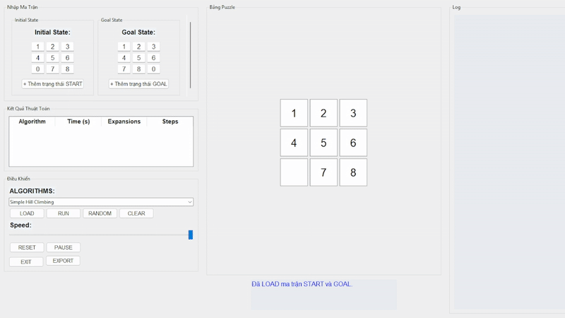
2. **Steepest-Ascent Hill Climbing:**
    - **Cách hoạt động:**
        - Duyệt toàn bộ các trạng thái kế cận, chọn tốt nhất (heuristic thấp nhất).
    - **Ưu điểm:**
        - Giảm rủi ro kẹt cục bộ hơn Simple Hill Climbing.
    - **Nhược điểm:**
        - Tốn thời gian hơn do phải duyệt toàn bộ lân cận.
    - **Kết quả trả về:**
        - Danh sách các trạng thái từ trạng thái ban đầu đến trạng thái đích và số bước di chuyển.

    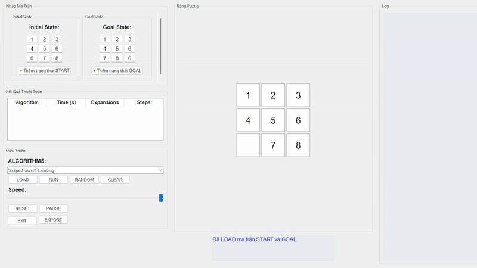
3. **Stochastic Hill Climbing:**
    - **Cách hoạt động:**
        - Ngẫu nhiên chọn một trạng thái lân cận có heuristic tốt hơn hiện tại.
    - **Ưu điểm:**
        - Có thể thoát khỏi cục bộ tốt hơn Simple Hill Climbing.
    - **Nhược điểm:**
        - Không ổn định, phụ thuộc vào may mắn.
    - **Kết quả trả về:**
        - Danh sách các trạng thái từ trạng thái ban đầu đến trạng thái đích và số bước di chuyển.

    
4. **Simulated Annealing:**
    - **Cách hoạt động:**
        - Cho phép chấp nhận trạng thái có heuristic cao hơn hiện tại (tệ hơn) với xác suất cao khi "nhiệt độ" còn lớn, giảm dần theo thời gian.
    - **Ưu điểm:**
        - Có khả năng thoát khỏi cực trị cục bộ hiệu quả.
    - **Nhược điểm:**
        - Cần điều chỉnh nhiệt độ và tốc độ giảm phù hợp để đạt hiệu quả
    - **Kết quả trả về:**
        - Danh sách các trạng thái từ trạng thái ban đầu đến trạng thái đích và số bước di chuyển.

    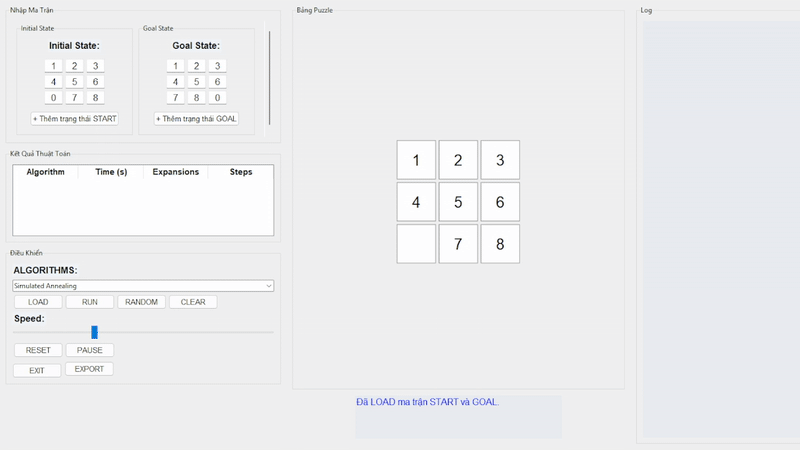
5. **Genetic Algorithm:**
    - **Cách hoạt động:**
        - Mô phỏng tiến hóa tự nhiên với một quần thể trạng thái. Mỗi thế hệ gồm:
            - Chọn lọc cá thể tốt nhất theo heuristic.
            - Lai ghép (crossover) giữa hai cá thể cha mẹ.
            - Đột biến (mutation) ngẫu nhiên.
    - **Ưu điểm:**
        - Tìm lời giải hiệu quả trong không gian trạng thái lớn.
    - **Nhược điểm:**
        - Phức tạp, cần điều chỉnh nhiều tham số (population size, mutation rate,...).
    - **Kết quả trả về:**
        - Danh sách các trạng thái từ trạng thái ban đầu đến trạng thái đích và số bước di chuyển.

    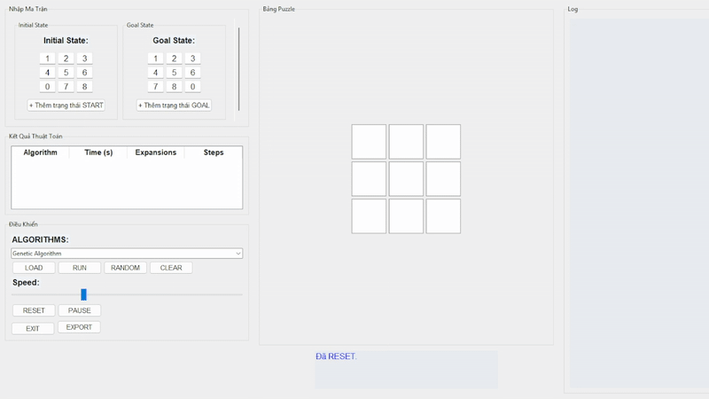
6. **Beam Search:**
    - **Cách hoạt động:**
        - Mỗi vòng chỉ giữ lại beam_width trạng thái tốt nhất (theo heuristic) để mở rộng.
    - **Ưu điểm:**
        - Kết hợp hiệu quả giữa mở rộng trạng thái và kiểm soát tài nguyên.
    - **Nhược điểm:**
        - Dễ bỏ sót lời giải tốt nếu beam width quá nhỏ.
    - **Kết quả trả về:**
        - Danh sách các trạng thái từ trạng thái ban đầu đến trạng thái đích và số bước di chuyển.

    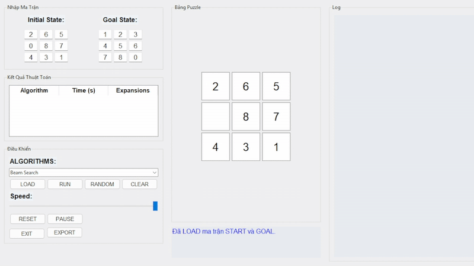
#### Giải pháp (Solution)
- **Định nghĩa:**
    - Lời giải là một chuỗi trạng thái có xu hướng cải thiện giá trị heuristic theo thời gian, hướng tới mục tiêu hoặc đạt trạng thái tốt nhất trong khả năng.
- **Kết quả:**
    - Nếu tìm được trạng thái mục tiêu:
        - Trả về các trạng thái trung gian, hành động tương ứng, và tổng số bước.
    - Nếu không tìm thấy:
        - Trả về thông báo không có lời giải.

#### So sánh thuật toán
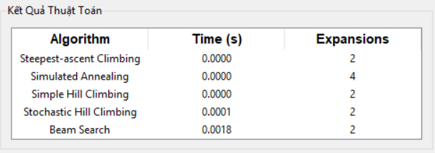
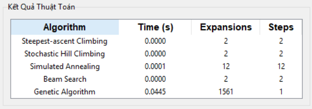

#### Nhận xét
- **Simple Hill Climbing:** Di chuyển nhanh chóng nhưng dễ kẹt tại cực trị cục bộ do không xét toàn bộ lựa chọn.
- **Steepest-Ascent Hill Climbing:** Giảm khả năng kẹt cực trị bằng cách chọn nước đi tốt nhất, nhưng tốn thời gian hơn.
- **Stochastic Hill Climbing:** Tránh kẹt cực trị bằng lựa chọn ngẫu nhiên, nhưng kết quả không ổn định.
- **Simulated Annealing:** Có thể thoát khỏi cực trị bằng cách chấp nhận giải tạm thời kém hơn, nhưng phụ thuộc vào tham số nhiệt độ.
- **Genetic Algorithm:** Tìm kiếm hiệu quả trên không gian lớn nhờ tiến hóa qua nhiều thế hệ, nhưng cần điều chỉnh nhiều tham số.
- **Beam Search:** Cân bằng tốc độ và hiệu quả bằng cách giới hạn số trạng thái mở rộng, nhưng có thể bỏ lỡ lời giải tốt hơn nếu beam quá nhỏ.

### 2.4. Các thuật toán tìm kiếm có ràng buộc (Constraint Satisfaction Problem)

#### Thành phần chính của bài toán 8-Puzzle

1. **Biến (Variables):**
    - Gồm 9 biến từ X1 đến X9, tương ứng với 9 ô trong ma trận 3x3 (đọc từ trái qua phải, từ trên xuống dưới).
2. **Miền giá trị (Domains):**
    - Mỗi biến nhận một giá trị từ 0 đến 8, biểu diễn thứ tự ô số. Các giá trị không được trùng nhau trong cùng một trạng thái.
3. **Ràng buộc (Constraints):**
    - Ràng buộc không trùng lặp giá trị: Mỗi số từ 0 đến 8 chỉ xuất hiện đúng một lần.
    - Ràng buộc ngang: Nếu hai ô liền kề ngang (ví dụ X1–X2) thì giá trị bên phải lớn hơn bên trái đúng 1 đơn vị, và bên trái không phải là 0.
    - Ràng buộc dọc: Nếu hai ô liền kề dọc (ví dụ X1–X4) thì giá trị bên dưới lớn hơn bên trên đúng 3 đơn vị, và bên trên không phải là 0.
    - Các ràng buộc trên được dùng để sinh ra các trạng thái khởi đầu hợp lệ, có thể giải được.
4. **Hàm kiểm tra trạng thái hợp lệ (is_solvable):**
    -Sau khi gán toàn bộ giá trị cho các biến, trạng thái được kiểm tra bằng hàm `is_solvable()` để đảm bảo có thể đạt đến trạng thái mục tiêu trong trò chơi 8-Puzzle.

#### Thuật toán và cách tiếp cận giải pháp
1. **Backtracking CSP:**
    - **Cách hoạt động**
        - Gán lần lượt giá trị cho từng biến theo miền đã xáo trộn, kiểm tra ràng buộc tại mỗi bước, nếu không thỏa thì quay lui và thử giá trị khác.
    - **Ưu điểm**
        - Cấu trúc đơn giản, dễ triển khai.
        - Có thể tìm được trạng thái hợp lệ thỏa tất cả ràng buộc.
    - **Nhược điểm**
        - Dễ bị rơi vào quay lui nhiều nếu thứ tự miền giá trị không tối ưu.
        - Thời gian thực thi tăng nhanh khi không gian tìm kiếm lớn.
    - **Kết quả trả về**
        - Trạng thái 3x3 hợp lệ thỏa ràng buộc và có thể giải được, hoặc None nếu không có.

    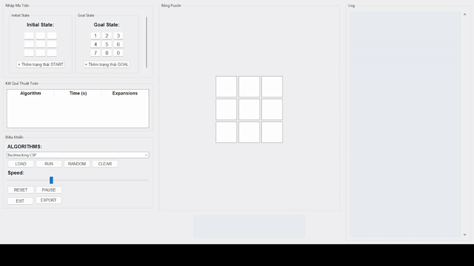

2. **Backtracking AC3:**
    - **Cách hoạt động**
        - Trước khi backtrack, thuật toán AC-3 được dùng để loại bỏ các giá trị trong miền không thỏa ràng buộc (duy trì tính nhất quán cung), sau đó mới tiến hành backtracking.
    - **Ưu điểm**
        - Hiệu quả cao nhờ thu hẹp miền giá trị trước khi gán.
        - Giảm đáng kể số lần quay lui so với backtracking đơn thuần.
    - **Nhược điểm**
        - Cần thêm chi phí xử lý cung (arc processing).
        - Cấu trúc phức tạp hơn và đòi hỏi kiểm soát tốt miền.
    - **Kết quả trả về**
        - Trạng thái hợp lệ thỏa ràng buộc, số cung đã xử lý, số nút mở rộng, hoặc None nếu không có.  

    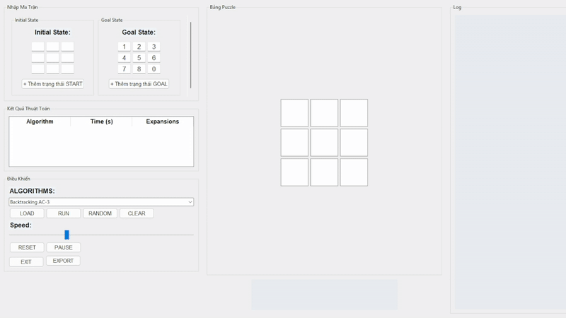

3. **Trial And Error:**
    - **Cách hoạt động**
        - Thử gán ngẫu nhiên toàn bộ giá trị cho 9 biến. Nếu không thỏa ràng buộc hoặc không is_solvable, thử lại toàn bộ từ đầu cho đến khi tìm được trạng thái hợp lệ hoặc thất bại.
    - **Ưu điểm**
        - Cực kỳ đơn giản và nhanh để cài đặt.
        - Có thể sinh trạng thái hợp lệ trong thời gian ngắn nếu may mắn.
    - **Nhược điểm**
        - Không kiểm tra từng bước, chỉ kiểm tra sau khi gán xong.
        - Hiệu suất thấp, thiếu kiểm soát, dễ bị thử lại nhiều lần mà không có kết quả.
    - **Kết quả trả về**
        - Trạng thái hợp lệ thỏa ràng buộc, số cung đã xử lý, số nút mở rộng, hoặc None nếu không có.

    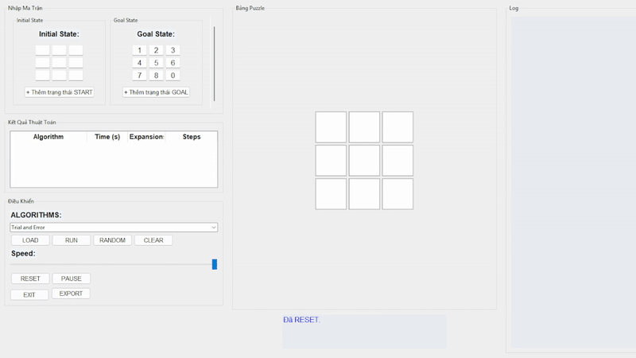

#### Giải pháp (Solution)
- **Định nghĩa:**
    - Một lời giải trong CSP là một trạng thái đầu vào hợp lệ cho bài toán 8-Puzzle, được sinh ra bằng cách gán giá trị cho các biến X1 đến X9 sao cho:
        - Thỏa tất cả các ràng buộc logic (không trùng giá trị, ràng buộc ngang – dọc).
        - Được xác minh là có thể giải được bằng hàm is_solvable().
- **Kết quả:**
    - Nếu tìm được trạng thái mục tiêu:
        - Trả về các trạng thái trung gian, hành động tương ứng, và tổng số bước.
    - Nếu không tìm thấy:
        - Trả về thông báo không có lời giải.

#### So sánh thuật toán
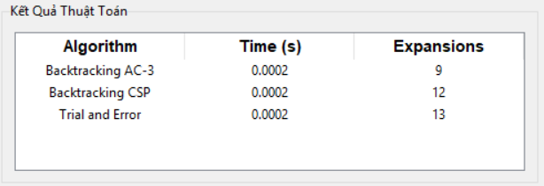

#### Nhận xét
- **Backtracking CSP:** Dễ hiểu và hiệu quả trong các bài toán nhỏ, nhưng dễ bị quay lui sâu khi không tối ưu miền.
- **Backtracking AC3:** Tối ưu hóa quá trình gán giá trị bằng cách loại trừ sớm, nhưng cần xử lý thêm bước chuẩn hóa miền.
- **Trial And Error:** Nhanh để thử nghiệm nhưng thiếu định hướng và không đảm bảo hiệu quả khi không gian lớn.

### 2.5. Các thuật toán tìm kiếm môi trường phức tạp

#### Thành phần chính của bài toán 8-Puzzle

1. **Trạng thái ban đầu (Initial State):**
    - Không phải là một trạng thái duy nhất mà là tập hợp nhiều trạng thái khả dĩ. Ví dụ: {(1, 2, 3, 4, 5, 6, 0, 7, 8), (1, 2, 3, 4, 5, 6, 7, 0, 8)}.
2. **Trạng thái mục tiêu (Goal State):**
    - Một hoặc nhiều trạng thái đích mà người dùng xác định trước, thường là trạng thái có các ô sắp xếp theo thứ tự như (1, 2, 3, 4, 5, 6, 7, 8, 0) nhưng cũng có thể là các cấu hình khác được nhập vào để kiểm tra tính linh hoạt và tính tổng quát của thuật toán.
3. **Không gian trạng thái (State Space):**
    - Tất cả các trạng thái có thể đạt được từ bất kỳ trạng thái nào trong tập trạng thái ban đầu thông qua các hành động hợp lệ.
4. **Tập hợp các hành động (Actions):**
    - Di chuyển ô trống (0) theo bốn hướng (nếu hợp lệ):
        - Di chuyển lên.
        - Di chuyển xuống.
        - Di chuyển sang trái.
        - Di chuyển sang phải.
    - Với belief state, một hành động được áp dụng đồng thời cho mọi trạng thái trong tập hợp.
5. **Hàm chuyển đổi (Transition Function):**
    - Khi thực hiện một hành động, tất cả các trạng thái trong tập niềm tin được cập nhật theo kết quả chuyển đổi tương ứng (nếu hợp lệ).
6. **Điều kiện dừng:**
    - Với Sensorless và Belief-State Search: Khi toàn bộ tập belief state chỉ còn duy nhất một trạng thái và đó là trạng thái mục tiêu.
    - Với AND-OR Search: Khi toàn bộ các nhánh AND đều dẫn đến đích, hoặc tồn tại một kế hoạch thoả mãn tất cả điều kiện mục tiêu.

#### Thuật toán và cách tiếp cận giải pháp
1. **Sensorless Search (No Observation Search):**
    - **Cách hoạt động**
        - Bắt đầu với một tập trạng thái ban đầu lớn (ví dụ, toàn bộ trạng thái có thể).
        - Áp dụng các hành động một cách mù quáng, liên tục rút gọn tập hợp trạng thái cho đến khi chỉ còn lại một trạng thái mục tiêu.
    - **Ưu điểm**
        - Không cần biết vị trí chính xác ban đầu vẫn có thể tìm được lời giải chung.
    - **Nhược điểm**
        - Chạy chậm và mở rộng rất nhiều trạng thái, đặc biệt nếu tập trạng thái khởi đầu quá lớn.
    - **Kết quả trả về**
        - Một chuỗi hành động áp dụng được từ mọi trạng thái ban đầu để đưa tất cả đến cùng một trạng thái đích.

    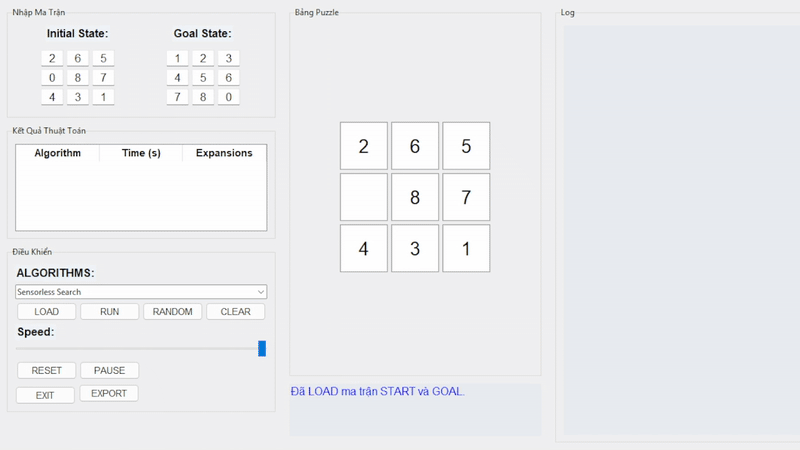

2. **Belief-State BFS (Partial Observation Search):**
    - **Cách hoạt động**
        - Tác nhân có một belief state gồm các trạng thái khả dĩ.
        - Thực hiện BFS trên tập belief state – mở rộng từng hành động lên toàn bộ belief state tại mỗi bước.
    - **Ưu điểm**
        - Hiệu quả hơn Sensorless vì có thể loại bỏ các trạng thái không còn phù hợp sau mỗi bước.
        - Giữ được tính chất tối ưu của BFS.
    - **Nhược điểm**
        - Tốn nhiều bộ nhớ khi tập belief state lớn, dễ bị không giải được nếu không có kỹ thuật lọc hiệu quả.
    - **Kết quả trả về**
        - Dãy hành động dẫn tập belief state về tập nhỏ hơn (tốt nhất là chỉ còn trạng thái mục tiêu).  

    

3. **AND-OR Search:**
    - **Cách hoạt động**
        - Phân loại mỗi trạng thái là nút AND hoặc OR:
            - Nút OR: Chọn một hành động bất kỳ là đủ.
            - Nút AND: Tất cả các hành động con đều phải thành công.
        - Xây dựng cây kế hoạch (AND-OR tree), từ đó xác định chiến lược hành động theo nhánh.
    - **Ưu điểm**
        - Mô hình hóa được các vấn đề có tính không xác định, đa kịch bản, cần xử lý đồng thời nhiều khả năng.
    - **Nhược điểm**
        - Quá trình xây dựng cây kế hoạch phức tạp, dễ tiêu tốn tài nguyên và khó mở rộng.
    - **Kết quả trả về**
        - Một chuỗi hành động áp dụng được từ mọi trạng thái ban đầu để đưa tất cả đến cùng một trạng thái đích.

    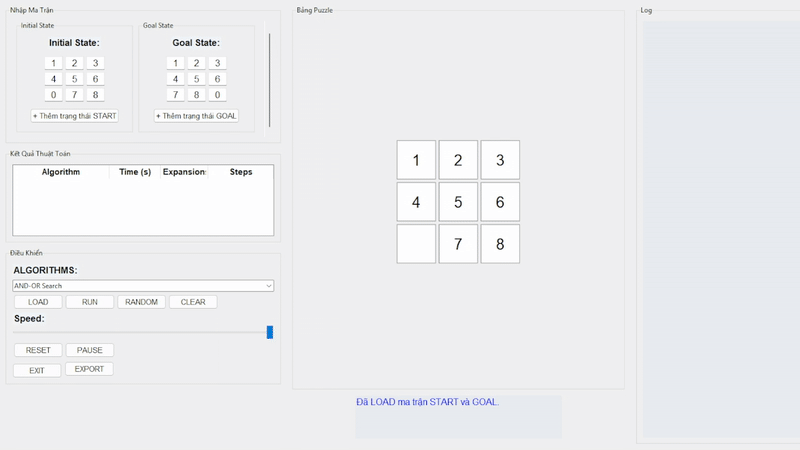

#### Giải pháp (Solution)
- **Định nghĩa:**
    - Lời giải là chuỗi hành động áp dụng cho belief state để:
        - Đưa toàn bộ belief state về đích (Sensorless / Belief)
        - Tạo một cây kế hoạch hành động thoả điều kiện AND và OR.
- **Kết quả:**
    - Nếu tìm được trạng thái mục tiêu:
        - Trả về các trạng thái trung gian, hành động tương ứng, và tổng số bước.
    - Nếu không tìm thấy:
        - Trả về thông báo không có lời giải.

#### So sánh thuật toán
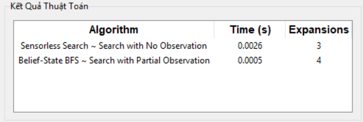
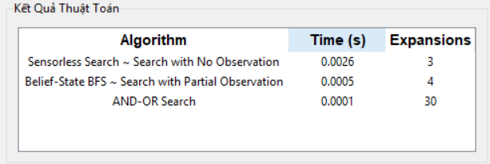

#### Nhận xét
- **Sensorless Search:** Phù hợp khi không biết trạng thái ban đầu nhưng rất tốn tài nguyên và khó thu hẹp tập trạng thái.
- **Belief-State BFS:** Giữ tính hiệu quả và dễ hiểu, phù hợp khi biết một phần trạng thái, nhưng vẫn nặng nếu không có heuristic lọc.
- **AND-OR Search:** Mô phỏng được các kế hoạch phức tạp với nhiều ràng buộc, nhưng triển khai khó khi không gian trạng thái lớn.

### 2.6. Học tăng cường (Reinforcement Learning)

#### Thành phần chính của bài toán 8-Puzzle

1. **Trạng thái ban đầu (Initial State):**
    - Là một hoán vị hợp lệ của các số từ 0 đến 8, được biểu diễn dưới dạng tuple 1 chiều gồm 9 phần tử, tương ứng với ma trận 3x3. Ví dụ: (2, 6, 5, 0, 8, 7, 4, 3, 1).
2. **Trạng thái mục tiêu (Goal State):**
    - Trạng thái cần đạt đến, thường được định nghĩa là (1, 2, 3, 4, 5, 6, 7, 8, 0) – các số được sắp xếp tăng dần và ô trống ở vị trí cuối cùng.tính linh hoạt và tính tổng quát của thuật toán.
3. **Không gian trạng thái (State Space):**
    - Tất cả các trạng thái có thể đạt được từ bất kỳ trạng thái nào trong tập trạng thái ban đầu thông qua các hành động hợp lệ.
4. **Tập hợp các hành động (Actions):**
    - Di chuyển ô trống (0) theo bốn hướng (nếu hợp lệ):
        - Di chuyển lên.
        - Di chuyển xuống.
        - Di chuyển sang trái.
        - Di chuyển sang phải.
    - Với belief state, một hành động được áp dụng đồng thời cho mọi trạng thái trong tập hợp.
5. **Phần thưởng (Reward):**
    - +100 điểm nếu đến đúng trạng thái mục tiêu.
    - –1 điểm cho mỗi bước đi để khuyến khích giải nhanh.
    - 0 điểm cho các hành động khác.
6. **Chính sách (Policy):**
    - Là chiến lược chọn hành động tại mỗi trạng thái, được học dần dần qua quá trình huấn luyện.
7. **Bảng Q**
    - Lưu giá trị Q của từng cặp (state, action) để đánh giá hành động nào nên thực hiện tại mỗi trạng thái.
8. **Chiến lược chọn hành động (Epsilon-Greedy):**
    - Với xác suất ε: chọn hành động ngẫu nhiên (exploration).
    - Với xác suất 1 – ε: chọn hành động có Q-value cao nhất (exploitation).
9. **Tập huấn luyện (Episodes):**
    -  Là số vòng lặp mà tác nhân sẽ học từ môi trường. Sau mỗi tập, bảng Q được cập nhật để dần dần cải thiện chính sách.

#### Thuật toán và cách tiếp cận giải pháp
1. **Q-Learning:**
    - **Cách hoạt động**
        - Bắt đầu từ một trạng thái ban đầu ngẫu nhiên.
        - Trong mỗi bước, sử dụng ε-greedy để chọn hành động.
        - Thực hiện hành động, quan sát trạng thái mới và phần thưởng.
        - Cập nhật giá trị Q theo công thức Q-learning.
        - Kết thúc tập khi đến trạng thái mục tiêu hoặc vượt quá số bước giới hạn.
        - Sau quá trình huấn luyện, sử dụng bảng Q để tìm đường đi tối ưu.
    - **Ưu điểm**
        - Có thể áp dụng cho các môi trường không biết trước.
        - Cải thiện dần qua các tập huấn luyện.
    - **Nhược điểm**
        - Thời gian huấn luyện có thể dài nếu không gian trạng thái lớn.
        - Hiệu quả phụ thuộc vào tham số (learning rate, discount factor, epsilon).
    - **Kết quả trả về**
        - Một chuỗi hành động áp dụng được từ mọi trạng thái ban đầu để đưa tất cả đến cùng một trạng thái đích.

    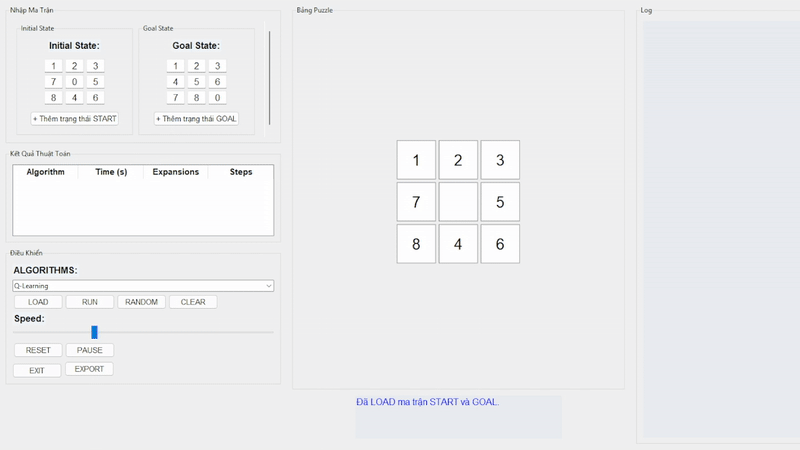

#### Giải pháp (Solution)
- **Định nghĩa:**
    - Lời giải là một chuỗi hành động tối ưu được trích xuất từ bảng Q sau quá trình huấn luyện, từ trạng thái ban đầu đến trạng thái mục tiêu.
- **Kết quả:**
    - Nếu bảng Q hội tụ: trả về dãy hành động và trạng thái trung gian dẫn đến mục tiêu.
    - Nếu không hội tụ: dãy hành động có thể không tối ưu hoặc không đến đích.

#### So sánh thuật toán
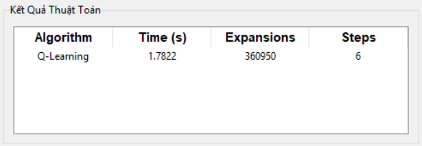

#### Nhận xét
- **Q-Learning:** Phù hợp cho môi trường không xác định, học tốt qua trải nghiệm, nhưng đòi hỏi số lượng tập huấn luyện lớn và kiểm soát tốt tham số để đạt kết quả tối ưu.

## 3. Kết luận
Dự án **8-Puzzle Visualizer** đă đạt những yêu cầu áp dụng thành công các thuật toán Trí tuệ Nhân tạo đã được học để giải bài toán 8-puzzle.
- **Xây dựng thành công 6 nhóm thuật toán**: Dự án được tích hợp các nhóm thuật toán từ cơ bản (BFS, DFS) đến nâng cao (A*, Q-Learning,...). Mỗi nhóm được triển khai với hiệu suất khác nhau thể hiện sự đa dạng và độ phức tạp của từng thuật toán.
- **So sánh hiệu suất chi tiết**: Các thuật toán được đánh giá dựa trên thời gian chạy và số lần mở rộng trạng thái giúp làm rõ được ưu điểm và nhược điểm của từng phương pháp được sử dụng.
- **Xây dựng giao diện trực quan**: Giao diện người dùng sử dụng Tkinter để phát triển giúp người dùng dễ dàng nhập trạng thái ban đầu/mục tiêu có thể thêm và xóa các trạng thái đối với những nhóm cần tập các trạng thái, chọm thuật toán, theo dõi quá trình di chuyển của thuật toán. Điều này giúp người dùng hiểu rõ được cách hoạt động của các thuật toán.
- **Giá trị học tập**: Dự án giúp sinh viên tạo công cụ học tập hiệu quả, minh họa lý thuyết Trí tuệ Nhân tạo thông qua các ví dụ trực quan (GIF) và số liệu so sánh cũng như phân tích các ưu/nhược điểm của từng phương pháp. Đồng thời giúp rèn luyện kỹ năng lập trình và xử lý các tình huống khó khăn trong quá trình code.

## 👤 Tác giả

- **Trần Lê Quốc Đại**  
- **MSSV:** 23110201  
- **Môn học:** Trí Tuệ Nhân Tạo  
- **Trường:** Đại học Sư phạm Kỹ thuật TP.HCM (HCMUTE)  
---

> © 2025 – Trần Lê Quốc Đại – HCMUTE

