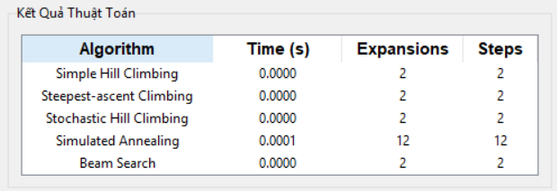
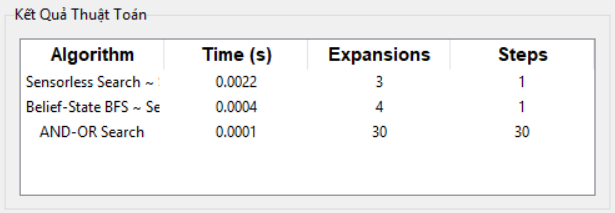

# 8-Puzzle Visualizer

## 1. Mục tiêu

Dự án **8-Puzzle Visualizer** được phát triển với các mục tiêu chính như sau:
- **Triển khai các thuật toán AI**: Áp dụng các thuật toán được học được học trong Trí tuệ Nhân tạo (AI) để giải bài toán 8-puzzle, bao gồm các phương pháp cơ bản (Breadth-First Search, Depth-First Search) đến nâng cao (A*, Genetic Problem, Q-Learning).
- **Xây dựng giao diện trực quan**: Tạo một giao diện người dùng (GUI) sử dụng Tkinter, cho phép người dùng nhập trạng thái bắt đầu, kết thúc, chọn thuật toán và quan sát quá trình giải chi tiết, điều chỉnh tốc độ mô phỏng, xuất kết quả dưới dạng file csv. Giao diện được tối ưu để thân thiện và hỗ trợ tương tác với người dùng.
- **So sánh hiệu suất**: Đánh giá hiệu quả của thuật toán dựa trên thời gian chạy (tính bằng giây) và số lần mở rộng trạng thái (expansions) giúp hiểu rõ được ưu/nhược điểm của từng thuật toán sử dụng.
- **Hỗ trợ học tập**: Cung cấp một công cụ trực quan, dễ sử dụng để minh họa và phân tích cá thuật toán, phục vụ cho việc trực quan các thuật toán một cách dễ hiểu. Bài tập cá nhân cũng là một dự án giúp củng cố lý thuyết, kỹ năng lập trình, khả năng phân tích vấn đề.

---

## 2. Nội dung
Dự án **8-Puzzle Visualizer** triển khai bài toán 8-puzzle, một bài toán cổ điển trong Trí tuệ Nhân tạo, với mục tiêu sắp xếp các ô số từ trạng thái ban đầu về trạng thái mục tiêu thông qua việc di chuyển ô trống. Dự án tích hợp **sáu nhóm thuật toán** tìm kiếm, bao gồm:
- **Tìm kiếm không có thông tin** (Uninformed Search): Các thuật toán dựa trên khám phá mù, không sử dụng hàm thông tin heuristic.
- **Tìm kiếm có thông tin** (Informed Search): Các thuật toán sử dụng heuristic để hướng dẫn tìm kiếm một cách hiệu quả hơn.
- **Tìm kiếm có ràng buộc** (Constraint Satisfaction Problem): Các thuật toán giải bài toán bằng cách gán các giá trị thỏa mãn với các ràng buộc cho trước.
- **Tìm kiếm cục bộ** (Local Search): Các thuật toán cải thiện trạng thái dần dần dựa trên hàm đánh giá.
- **Tìm kiếm trong môi trường phức tạp** (Searching in complex environments): Các thuật toán xử lý các tình huống không xác định hoặc quan sát không đầy đủ.
- **Học tăng cường** (Reinforcement Learning): Các thuật toán học từ kinh nghiệm để tìm lời giải tối ưu.

Mỗi nhóm được trình bày chi tiết với:
- **Thành phần chính của bài toán**: Mô tả trạng thái, hành động, kiểm tra mục tiêu, và hàm heuristic (nếu có).
- **Lời giải**: Chuỗi trạng thái và hành động từ trạng thái ban đầu đến mục tiêu.
- **GIF minh họa**: Hình ảnh động thể hiện quá trình giải của từng thuật toán.
- **So sánh hiệu suất**: Bảng so sánh ghi lại thời gian thực thi và số lần mở rộng (expansions) để so sánh (cùng trạng thái ban đầu và mục tiêu).
- **Nhận xét**: Phân tích ưu điểm, nhược điểm và hiệu quả khi áp dụng vào bài toán 8-puzzle.

### 2.1. Các thuật toán tìm kiếm không có thông tin (Uninformed Search)
### Thành phân chính của bài toán
- **Trạng thái**: Một tuple 9 phần tử được hiển thị dưới dạng 3x3, với các số hợp lệ từ 0 - 8 (0 là ô trống). Ví dụ: (2, 6, 5, 0, 8, 7, 4, 3, 1) là trạng thái ban đầu.
- **Hành động**: Di chuyển ô trống theo 4 hướng: lên, xuống, trái, phải để tạo ra các trạng thái tiếp theo.
- **Kiểm tra mục tiêu**: So sánh trạng thái hiện tại với trạng thái mục tiêu, thường là: (1, 2, 3, 4, 5, 6, 7, 8, 0).
- **Hàm chi phí**: Mỗi hành động di chuyển có chi phí là 1.
- **Đặc điểm**: Không sử dụng hàm heuristic, dựa hoàn toàn vào cấu trúc không gian trạng thái.
### Lời giải
- Lời giải là một danh sách các trạng thái, biểu diễn chuỗi các bước di chuyển hợp lệ từ trạng thái ban đầu đến trạng thái mục tiêu.
### GIF minh họa thuật toán 
#### 🔍 BFS

#### 🔍 DFS

#### 🔍 UCS

#### 🔍 IDDFS

### So sánh thuật toán

- Ưu điểm
    -  BFS đảm bảo tìm được lời giải tối ưu nhất (đường đi ngắn nhất) trong không gian tìm kiếm hữu hạn.
    -  DFS nhanh nhất trong trong các trường hợp lời giải nằm gần gốc.
    -  UCS đảm bảo tìm được đi rẻ nhất (có thể không ngắn nhất).
    -  IDDFS cân bằng giữa độ chính xác của BFS và tiết kiệm bộ nhớ của DFS.
- Nhược điểm:
    - BFS và UCS sẽ gây tốn bộ nhớ do phải lưu tất cả trạng thái ở mỗi mức.
    - DFS không đảm bảo tối ưu có thể không giải được nếu nhánh sâu vô tận và giới hạn độ sâu không hợp lý.
    - IDDFS khi áp dụng lại chưa cho hiệu năng tốt nhất do hạn chế của DLS khi giới hạn độ sâu, hoặc đồ thị có chu trình.

### 2.2. Các thuật toán tìm kiếm không thông tin (Informed Search)
### Thành phân chính của bài toán
- **Trạng thái**: Một tuple 9 phần tử được hiển thị dưới dạng 3x3, với các số hợp lệ từ 0 - 8 (0 là ô trống). Ví dụ: (2, 6, 5, 0, 8, 7, 4, 3, 1) là trạng thái ban đầu.
- **Hành động**: Di chuyển ô trống theo 4 hướng: lên, xuống, trái, phải để tạo ra các trạng thái tiếp theo.
- **Kiểm tra mục tiêu**: So sánh trạng thái hiện tại với trạng thái mục tiêu, thường là: (1, 2, 3, 4, 5, 6, 7, 8, 0).
- **Hàm heuristic**: Sử dụng **Mahattan Distance** để tính tổng khoảng cách di chuyển của mỗi ô từ vị trí hiện tại (x1, y1) đến vị trí trạng thái mục tiêu (x2, y2), với công thức là |x1 - x2| + |y1 - y2|
- **Hàm chi phí**: Mỗi hành động di chuyển có chi phí là 1.
- **Đặc điểm**: Sử dụng hàm heuristic để hướng dẫn tìm kiếm không gian trạng thái.
#### Lời giải
- Lời giải là một danh sách các trạng thái tối ưu, dựa trên tổng chi phí đường đi g(n) và giá trị heuristic h(n).
    - Greedy chỉ sử dụng chi phí ước lượng => f(n) = h(n)
    - A* và IDA* sử dụng chi phí thực sự và chi phí ước lượng => f(n) = g(n) + h(n)

### GIF minh họa thuật toán 
#### 🔍 GREEDY

#### 🔍 A_STAR

#### 🔍 IDA_STAR

### So sánh thuật toán

- Ưu điểm
    - Greedy nhanh, phù hợp khi cần lời giải nhanh không cần tối ưu.
    - A* đảm bảo lời giải tối ưu nhất, khi ước lượng chi phí không lớn hơn chi phí thật từ vị trí hiện tại đến đích.
    - IDA* tiết kiệm bộ nhớ, phù hợp cho các bài toán lớn như 8-puzzle.
- Nhược điểm
    - Greedy chỉ ưu tiên về trạng thái mục tiêu nhanh nhất (tham lam), nên chi phí chưa được tối ưu, dẫn đến số bước giải sẽ nhiều hơn so với A*, IDA*.
    - A* sẽ không tối ưu nếu chi phí ước lượng không đảm bảo tính thống nhất, dẫn đến A* phải mở lại các node cũ để kiểm tra.
    - Tương tự như IDDFS, điểm yếu sẽ lộ rõ khi gặp những bài có nhánh sâu vô tận hoặc đồ thị có chu trình.

### 2.3. Các thuật toán tìm kiếm có ràng buộc (Constraint Satisfaction Problem)
### Thành phân chính của bài toán
- **Biến**: Có 9 biến, được kí hiệu từ X1 đến X9, tương ứng với 9 ô trên bảng 3x3 (trái qua phải, trên xuống dưới).
- **Miền giá trị**: Mỗi biến nhận giá trị từ 0 đến 8 (số 0 là ô trống), không trùng lặp. Và được xáo trộn ngẫu nhiên để tăng tính ngẫu nhiên trong việc chọn giá trị
- **Ràng buộc**:
    - **Ràng buộc ngang**: Các ô liền kề theo chiều ngang (X1-X2, X2-X3) phải thỏa mãn: giá trị của ô bên phải lớn hơn giá trị ô bên trái 1 đơn vị và ô bên trái không phải là 0.
    - **Ràng buộc dọc**: Các ô liền kề theo chiều dọc (X1-X4, X2-X2) phải thỏa mãn: giá trị của ô bên dưới lớn hơn giá trị ô bên trên 3 đơn vị và ô bên trên không phải là 0.
    - **Ràng buộc không trùng giá trị**: Mỗi biến phải nhận 1 giá trị duy nhất.
- **Kiểm tra khả năng**: Sau khi gán giá trị cho tất cả các biến, trạng thái cuối cùng sẽ được kiểm tra bằng hàm is_solvable để đảm bảo trạng thái có đạt được mục tiêu.
- **Đặc điểm**
    - Backtracking CSP và Trial And Error dựa vào việc gán giá trị và quay lui để tìm lời giải.
    - Backtracking AC3 giảm miền giá trị bằng AC3 sau đó mới áp dụng backtracking, giúp giảm số lần quay lui
    - Trong chương trình thực hiện xáo trộn miền giá trị cho CSP và Trial And Error dẫn đến đối lúc so sánh không đảm bảo chính xác tuyệt đối.
#### Lời giải
- Gán giá trị cho 9 biến X1 đến X9, thỏa mãn các ràng buộc (ngang, dọc, không giá trị) và tạo thành một trạng thái có khả năng thực hiện đển trạng thái mục tiêu.
- **Backtracking CSP**
    - Sử dụng thuật toán backtrack cơ bản để gán từng giá trị.
    - Kiểm tra tính hợp lệ của mỗi lần gán đảm bảo không trùng giá trị và thỏa các ràng buộc.
    - Nếu không thỏa, quay lui và thử giá trị khác.
    - Miền giá trị được xáo trộn để tăng tính ngẫu nhiên trong chọn giá trị.
- **Backtracking AC3**
    - Chạy thuật toán AC3 để lượt bớt miền giá trị không thỏa.
    - Áp dụng tương tự như Backtracking CSP.
- **Trial And Error**
    - Là một biến thể của Backtracking CSP, nhưng không tối ưu hóa miền giá trị.

### GIF minh họa thuật toán 
#### 🔍 BACKTRACKING AC3

#### 🔍 BACKTRACKING CSP

#### 🔍 TRIAL AND ERROR

### So sánh thuật toán

- Ưu điểm
    - Backtracking AC3 hiệu quả nhất nhờ giảm miền giá trị bằng AC3, dẫn đến ít lần quay lui.
    - Backtracking CSP đơn giản, dễ triển khai, không cần phải tối ưu và có thể tìm ra được lời giải.
    - Trial And Error rất đơn giản, phù hợp để triển khai minh họa cho CSP.
- Nhược điểm
    - Backtracking AC3 triển khai phức tạp cần quản lý các cung (arc) với những bài toán lớn phí chạy AC3 có thể tăng.
    - Backtracking CSP không giảm được miền giá trị, dẫn đến số lần quay lui nhiều, chậm hơn AC3.
    - Trial And Error hiệu suất kém nhất.

### 2.4. Các thuật toán tìm kiếm cục bộ (Local Search)
### Thành phân chính của bài toán
- **Trạng thái**: Một tuple 9 phần tử được hiển thị dưới dạng 3x3, với các số hợp lệ từ 0 - 8 (0 là ô trống). Ví dụ: (2, 6, 5, 0, 8, 7, 4, 3, 1) là trạng thái ban đầu.
- **Hành động**: Di chuyển ô trống theo 4 hướng: lên, xuống, trái, phải để tạo ra các trạng thái tiếp theo.
- **Kiểm tra mục tiêu**: So sánh trạng thái hiện tại với trạng thái mục tiêu, thường là: (1, 2, 3, 4, 5, 6, 7, 8, 0).
- **Hàm heuristic**: Sử dụng **Mahattan Distance** để tính tổng khoảng cách di chuyển của mỗi ô từ vị trí hiện tại (x1, y1) đến vị trí trạng thái mục tiêu (x2, y2), với công thức là |x1 - x2| + |y1 - y2|
- **Hàm chi phí**: Mỗi hành động di chuyển có chi phí là 1.
- **Đặc điểm**
    - Simple Hill Climbing chọn trạng thái lân cận đầu tiên có giá trị heuristic thấp hơn trạng thái hiện tại.
    - Steepest-Ascent Hill Climbing chọn trạng thái lân cận có giá trị heuristic thấp nhất trong tất cả lân cận để mở rộng.
    - Stochastic Hill Climbing chọn ngẫu nhiên một trạng thái lân cận tốt hơn (heuristic thấp hơn) để mở rộng.
    - Simulated Annealing chấp nhận trạng thái tệ hơn với xác suất giảm dần theo nhiệt độ, giúp thoát khỏi cực trị cục bộ.
    - Genetic Algorithm sử dụng quần thể trạng thái, áp dụng lai ghép và đột biến để tạo ra trạng thái tốt hơn qua các thế hệ.
    - Beam Search giữ lại một số lượng cố định (beam_width) trạng thái tốt nhất ở mỗi bước, thay vì mở rộng toàn bộ trạng thái lân cận (f(n) = g(n) + h(n)).
#### Lời giải
- Lời giải là một chuỗi các trạng thái, mỗi trạng thái cải thiện giá trị hàm đánh giá so với trạng thái trước, dẫn đến trạng thái mục tiêu.

### GIF minh họa thuật toán 
#### 🔍 SIMPLE HILL CLIMBING

#### 🔍 STEEPEST HILL CLIMBING

#### 🔍 STOCHASTIC HILL CLIMBING

#### 🔍 SIMULATED ANNEALING

#### 🔍 GENETIC ALGORITHM

#### 🔍 BEAM SEARCH

### So sánh thuật toán

- Ưu điểm
    - Simple Hill Climbing nhanh, đơn giản, phù hợp khi lời giải gần trạng thái ban đầu.
    - Steepest-Ascent Hill Climbing tìm trạng thái tốt nhất tăng khả năng thoát cực trị cục bộ so với Simple.
    - Stochastic Hill Climbing: Tránh cực trị cục bộ bằng cách chọn ngẫu nhiên.
    - Simulated Annealing: Thoát cực trị cụ bộ bằng thuật toán tìm kiếm lấy cảm hứng từ quá trình luyện kim, phù hợp các bài toán phức tạp.\
    - Genetic Algorithm: Mạnh mẽ với bài toán phức tạp, tìm lời giải tốt qua nhiều thế hệ.
    - Beam Search: Cân bằng giữa tốc độ và chất lượng bằng việc chỉ mở số lượng giới hạn tốt nhất thay vì tất cả.
- Nhược điểm
    - Simple Hill Climbing dễ bị kẹt ở giá trị cục bộ.
    - Steepest-Ascent Hill Climbing vẫn dễ bị kẹt ở giá trị cục bộ, mở rộng nhiều hơn Simple.
    - Stochastic Hill Climbing phụ thuộc vào may rủi, không có sự ổn định cao.
    - Simulated Annealing cần điều chỉnh các tham số trong hàm phù hợp.
    - Genetic Algorithm tốn tài nguyên, cần tối ưu hóa tham số
    - Beam Search nếu beam_width quá nhỏ có thể bỏ sót một số lời giải tốt.

### 2.5. Các thuật toán tìm kiếm môi trường phức tạp (Searching in complex environments)
### Thành phân chính của bài toán
- **Trạng thái**: Một tập hợp các trạng thái (belief state), biểu diễn tất cả trạng thái có thể của bài toán. Ví dụ tập: {(1,2,3,4,5,6,0,7,8); (1,2,3,4,5,6,7,0,8)}
- **Hành động**: Di chuyển ô trống, áp dụng đồng thời cho tất cả trạng thái trong tập hợp.
- **Kiểm tra mục tiêu**: Ít nhất một trạng thái trong tập hợp ban đầu khớp với một trạng thái mục tiêu, ví dụ: (1, 2, 3, 4, 5, 6, 7, 8, 0).
- **Đặc điểm**: Môi trường không xác định hoặc quan sát không đầy đủ, yêu cầu xử lý nhiều trạng thái cùng lúc.
    - Search with No Observation & Search with Partial Observation cần đầu vào một tập trạng thái.
    - AND-OR Search đầu vào chỉ cần 1 trạng thái.
#### Lời giải
- Lời giải là một chuỗi các hành động dẫn tập hợp trạng thái ban đầu đến tập hợp chứa trạng thái mục tiêu.

### GIF minh họa thuật toán 
#### 🔍 SENSORLESS SEARCH ~ Search with No Observation

#### 🔍 BELIEF-STATE BFS ~ Search with Partial Observation

#### 🔍 AND-OR SEARCH

### So sánh thuật toán

- Ưu điểm
    - AND-OR Search linh hoạt trong môi trường không xác định, phù hợp cho bài toán có nhiều khả năng.
    - Sensorless Search đảm bảo lời giải cho mọi trạng thái ban đầu, dù không cần quan sát.
    - Belief-state BFS hiệu quả hơn Sensorless vì biết được một phần của trạng thái, phù hợp với các trạng thái nhỏ.
- Nhược điểm
    - AND-OR Search phức tạp tốn nhiều tài nguyên do phải xử tất cả nhánh của AND và OR.
    - Sensorless Search chậm do phải khám phá toàn bộ không gian trạng thái.
    - Belief-state BFS tốn nhiều bộ nhớ khi tập trạng thái lớn.

### 2.6. Học tăng cường (Reinforcement Learning)
### Thành phân chính của bài toán
- **Trạng thái**: Một tuple 9 phần tử được hiển thị dưới dạng 3x3, với các số hợp lệ từ 0 - 8 (0 là ô trống). Ví dụ: (2, 6, 5, 0, 8, 7, 4, 3, 1) là trạng thái ban đầu.
- **Hành động**: Di chuyển ô trống theo 4 hướng: lên, xuống, trái, phải để tạo ra các trạng thái tiếp theo.
- **Phần thưởng**: +100 nếu đạt trạng thái mục tiêu, -1 cho mỗi bước di chuyển, 0 cho các trường hợp khác.
- **Bảng Q**: Lưu giá trị dự đoán cho mỗi cặp trạng thái-hành động, được cập nhật qua quá trình học.
    - Ví dụ: Với trạng thái (1, 2, 3, 4, 0, 6, 7, 5, 8), hành động "xuống" có thể dẫn đến phần thưởng -1 nhưng tiến gần mục tiêu.
- **Đặc điểm**: Học chính sách tối ưu bằng cách cập nhật bảng Q dựa trên phần thưởng và giá trị tối đa của trạng thái tiếp theo, sử dụng công thức: **Qₜ(s, a) = Qₜ₋₁(s, a) + α · TDₜ(s, a)**
    - Qₜ(s, a): Giá trị Q mới tại thời điểm t cho trạng thái s và hành động a.
    - Qₜ₋₁(s, a): Giá trị Q tại thời điểm t - 1
    - α: tốc độ học (learning rate) có giá trị 0 < α <= 1
    - TDₜ(s, a): Sai số thời gian tạm (TD error) tại thời điểm t
#### Lời giải
- Lời giải là một chuỗi trạng thái tối ưu, dựa trên chính sách học được từ bảng Q.

### GIF minh họa thuật toán 
#### 🔍 Q-LEARNING

### So sánh thuật toán

- Ưu điểm
    - Q-Learning phù hợp trong môi trường không biết trước, học được chính sách tối ưu Trial and Error.
    - Phù hợp cho các bài toán cần thích nghi với thay đổi hoặc không có mô hình rõ ràng.
- Nhược điểm
    - Yêu cầu nhiều thời gian học (số lượng episodes lớn) để bảng Q hội tụ.
    - Hiệu quả phụ thuộc vào tham số (alpha, gamma, epsilon) và kích thước không gian trạng thái.
    - Tốn nhiều tài nguyên hơn các thuật toán tìm kiếm khác trong 8-puzzle.

## 3. Kết luận
Dự án **8-Puzzle Visualizer** đă đạt những yêu cầu áp dụng thành công các thuật toán Trí tuệ Nhân tạo đã được học để giải bài toán 8-puzzle.
- **Xây dựng thành công 6 nhóm thuật toán**: Dự án được tích hợp các nhóm thuật toán từ cơ bản (BFS, DFS) đến nâng cao (A*, Q-Learning,...). Mỗi nhóm được triển khai với hiệu suất khác nhau thể hiện sự đa dạng và độ phức tạp của từng thuật toán.
- **So sánh hiệu suất chi tiết**: Các thuật toán được đánh giá dựa trên thời gian chạy và số lần mở rộng trạng thái giúp làm rõ được ưu điểm và nhược điểm của từng phương pháp được sử dụng.
- **Xây dựng giao diện trực quan**: Giao diện người dùng sử dụng Tkinter để phát triển giúp người dùng dễ dàng nhập trạng thái ban đầu/mục tiêu có thể thêm và xóa các trạng thái đối với những nhóm cần tập các trạng thái, chọm thuật toán, theo dõi quá trình di chuyển của thuật toán. Điều này giúp người dùng hiểu rõ được cách hoạt động của các thuật toán.
- **Giá trị học tập**: Dự án giúp sinh viên tạo công cụ học tập hiệu quả, minh họa lý thuyết Trí tuệ Nhân tạo thông qua các ví dụ trực quan (GIF) và số liệu so sánh cũng như phân tích các ưu/nhược điểm của từng phương pháp. Đồng thời giúp rèn luyện kỹ năng lập trình và xử lý các tình huống khó khăn trong quá trình code.

## 👤 Tác giả

- **Trần Lê Quốc Đại**  
- **MSSV:** 23110201  
- **Môn học:** Trí Tuệ Nhân Tạo  
- **Trường:** Đại học Sư phạm Kỹ thuật TP.HCM (HCMUTE)  
---

> © 2025 – Trần Lê Quốc Đại – HCMUTE

