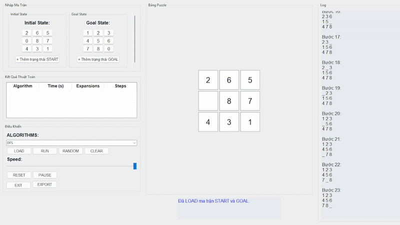
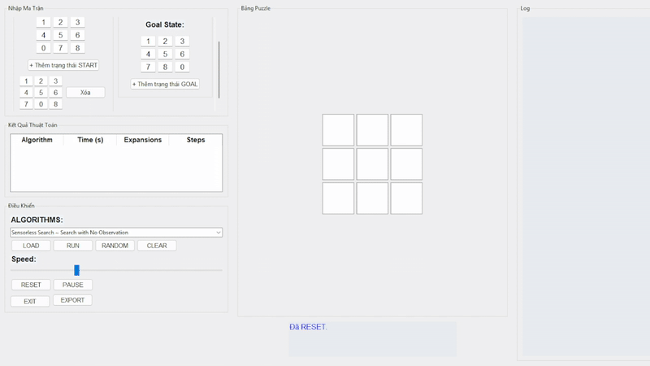

# 🧩 8-Puzzle Visualizer

## 🧠 Giới thiệu

**8-Puzzle Visualizer** là ứng dụng được phát triển bằng Python với giao diện trực quan sử dụng `Tkinter`, nhằm mô phỏng quá trình hoạt động của các thuật toán Trí tuệ Nhân tạo trong việc giải bài toán 8-puzzle cổ điển. Ứng dụng hỗ trợ đa dạng thuật toán từ tìm kiếm không heuristic đến các kỹ thuật nâng cao như tìm kiếm niềm tin và giải thuật tiến hóa.

---

## ⚙️ Tính năng chính

### 🔎 Các nhóm thuật toán được hỗ trợ:

#### 📘 1. **Tìm kiếm không sử dụng heuristic (Uninformed Search):**
- Breadth-First Search (BFS) – Tìm kiếm theo chiều rộng
- Depth-First Search (DFS) – Tìm kiếm theo chiều sâu
- Uniform Cost Search (UCS) – Tìm kiếm chi phí đều
- Iterative Deepening Search (IDDFS) – Tìm kiếm sâu dần
- Backtracking Search – Tìm kiếm quay lui
- Backtracking CSP – Giải bằng ràng buộc (Constraint Satisfaction)

#### 📙 2. **Tìm kiếm sử dụng heuristic (Informed Search):**
- Greedy Best-First Search – Tìm kiếm tham lam
- A* Search – A sao
- IDA* (Iterative Deepening A*) – A* sâu dần
- Beam Search – Tìm kiếm chùm

#### 📕 3. **Tìm kiếm cục bộ (Local Search):**
- Simple Hill Climbing – Leo đồi đơn giản
- Steepest Ascent Climbing – Leo đồi dốc nhất
- Stochastic Hill Climbing – Leo đồi ngẫu nhiên
- Simulated Annealing – Mô phỏng luyện kim

#### 📗 4. **Thuật toán tiến hóa (Evolutionary):**
- Genetic Algorithm – Giải thuật di truyền

#### 📒 5. **Tìm kiếm trạng thái niềm tin (Belief-Based Search):**
- Sensorless Search – Tìm kiếm không cảm biến
- Belief-State BFS – Tìm kiếm niềm tin theo BFS

#### 📓 6. **Khác:**
- AND-OR Search – Tìm kiếm điều kiện rẽ nhánh
- Trial-and-Error – Thuật toán thử và sai

---

## 🖥️ Giao diện người dùng (GUI)

- Giao diện hiện đại bằng Tkinter, dễ thao tác.
- Hình ảnh hóa từng bước di chuyển trong lời giải.
- Cho phép chọn giải thuật và chạy từng bước (step-by-step).
- Điều chỉnh tốc độ mô phỏng theo thanh trượt.
- Sinh ngẫu nhiên trạng thái ban đầu hợp lệ với lựa chọn độ khó.
- Xuất báo cáo kết quả chạy dưới dạng CSV.
- Log trực tiếp diễn tiến lời giải.

---

## 📂 Cấu trúc thư mục

```
8-puzzle-visualizer/
├── algorithms/
│   ├── uninformed.py
│   ├── informed.py
│   ├── local.py
│   ├── belief_state.py
│   ├── evolutionary.py
│   ├── and_or.py
│   └── helpers.py
├── app/
│   └── gui.py
├── main.py
├── README.md
├── gif/
│   └── *.gif
```

---

## 👤 Tác giả

- **Trần Lê Quốc Đại**  
- **MSSV:** 23110201  
- **Môn học:** Trí Tuệ Nhân Tạo  
- **Trường:** Đại học Sư phạm Kỹ thuật TP.HCM (HCMUTE)  

---

## 📽️ Minh họa lời giải từng thuật toán

### 🔍 BFS


### 🔍 DFS


### 🔍 UCS


### 🔍 IDDFS


### 🔍 A*


### 🔍 IDA*


### 🔍 Greedy Best First Search


### 🔍 Simple Hill Climbing


### 🔍 Steepest Ascent Hill Climbing


### 🔍 Beam Search


### 🔍 Genetic Algorithm


### 🔍 AND-OR Search


### 🔍 Sensorless Search


---

> © 2025 – Trần Lê Quốc Đại – HCMUTE
