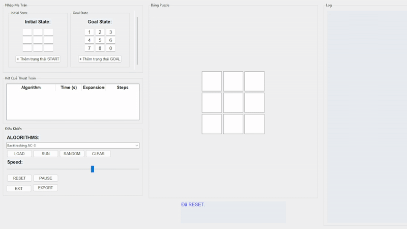
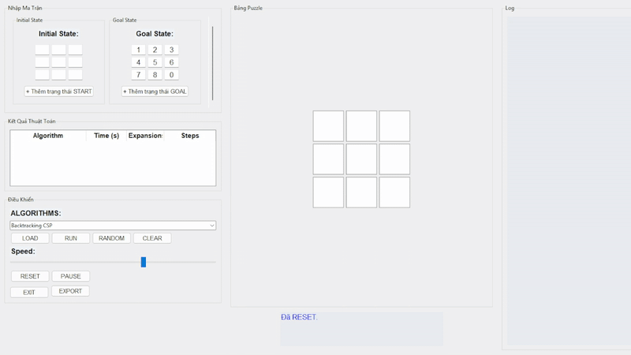
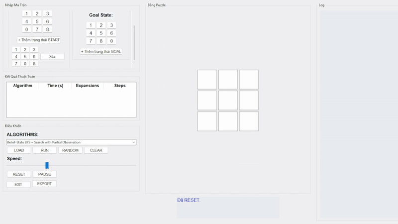

# 🧩 8-Puzzle Visualizer

## 1. Mục tiêu

Dự án **8-Puzzle Visualizer** được phát triển với các mục tiêu chính như sau:
- **Triển khai các thuật toán AI**: Áp dụng các thuật toán được học được học trong Trí tuệ Nhân tạo (AI) để giải bài toán 8-puzzle, bao gồm các phương pháp cơ bản đến nâng cao.
- **Xây dựng giao diện trực quan**: Tạo một giao diện người dùng (GUI) sử dụng Tkinter, cho phép người dùng nhập trạng thái bắt đầu, kết thúc, chọn thuật toán và quan sát quá trình giải chi tiết.
- **So sánh hiệu suất**: Đánh giá hiệu quả của thuật toán dựa trên thời gian chạy và số lần mở rộng trạng thái (expansions) giúp hiểu rõ được ưu/nhược điểm của từng thuật toán sử dụng.
-- **Hỗ trợ học tập**: Cung cấp một công cụ trực quan, dễ sử dụng để minh họa và phân tích cá thuật toán, phục vụ cho việc trực quan các thuật toán một cách dễ hiểu.

---

## ⚙️ Tính năng chính

### 🔎 Các nhóm thuật toán được hỗ trợ:

#### 📘 1. **Tìm kiếm không có thông tin (Uninformed Search):**
- Breadth-First Search (BFS) – Tìm kiếm theo chiều rộng
- Depth-First Search (DFS) – Tìm kiếm theo chiều sâu
- Uniform Cost Search (UCS) – Tìm kiếm chi phí đều
- Iterative Deepening DFS (IDDFS) – Tìm kiếm sâu dần

#### 📙 2. **Tìm kiếm có thông tin (Informed Search):**
- Greedy Best-First Search – Tìm kiếm tham lam
- A* Search – A sao
- IDA* – A* sâu dần

#### 📘 3. **Tìm kiếm có ràng buộc (Constraint Search):**
- Backtracking AC-3
- Backtracking CSP
- Trial and Error

#### 📕 4. **Tìm kiếm cục bộ (Local Search):**
- Simple Hill Climbing
- Steepest-ascent Climbing
- Stochastic Hill Climbing
- Simulated Annealing
- Beam Search
- Genetic Algorithm

#### 📒 5. **Tìm kiếm trong môi trường phức tạp:**
- AND-OR Search
- Sensorless Search ~ Search with No Observation
- Belief-State BFS ~ Search with Partial Observation

#### 📗 6. **Học củng cố (Reforcement Learning):**
- Q-Learning
---

## 🖥️ Giao diện người dùng (GUI)

- Giao diện hiện đại bằng Tkinter, dễ thao tác.
- Hình ảnh hóa từng bước di chuyển trong lời giải.
- Cho phép chọn giải thuật và chạy từng bước (step-by-step).
- Điều chỉnh tốc độ mô phỏng theo thanh trượt.
- Sinh ngẫu nhiên trạng thái ban đầu hợp lệ với lựa chọn độ khó.
- Xuất báo cáo kết quả chạy dưới dạng CSV.
- Log trực tiếp diễn tiến lời giải.

---

## 📂 Cấu trúc thư mục

```
PUZZLE_AI_MIDTERM/
├── algorithms/
│ ├── pycache/
│ ├── and_or.py
│ ├── belief_state.py
│ ├── constraint.py
│ ├── evolutionary.py
│ ├── helpers.py
│ ├── informed.py
│ ├── local.py
│ └── uninformed.py
├── app/
│ ├── pycache/
│ └── gui.py
├── gif/
│ └── *.gif
├── main.py
├── README.md
```

---

## 👤 Tác giả

- **Trần Lê Quốc Đại**  
- **MSSV:** 23110201  
- **Môn học:** Trí Tuệ Nhân Tạo  
- **Trường:** Đại học Sư phạm Kỹ thuật TP.HCM (HCMUTE)  

---

## 📽️ Minh họa lời giải theo từng nhóm thuật toán

### 📘 Tìm kiếm không có thông tin
### 🔍 BFS

### 🔍 DFS

### 🔍 UCS

### 🔍 IDDFS


### 📙 Tìm kiếm có thông tin
### 🔍 GREEDY

### 🔍 A_STAR

### 🔍 IDA_STAR


### 📘 Tìm kiếm có ràng buộc
### 🔍 BACKTRACKING AC3

### 🔍 BACKTRACKING CSP

### 🔍 TRIAL AND ERROR


### 📕 Tìm kiếm cục bộ
### 🔍 SIMPLE HILL CLIMBING

### 🔍 STEEPEST HILL CLIMBING

### 🔍 STOCHASTIC HILL CLIMBING

### 🔍 SIMULATED ANNEALING

### 🔍 BEAM SEARCH

### 🔍 GENETIC ALGORITHM


### 📒 Tìm kiếm trong môi trường phức tạp
### 🔍 SENSORLESS SEARCH

### 🔍 BELIEF-STATE BFS

### 🔍 AND-OR SEARCH


### 📗 Học củng cố
### 🔍 Q-LEARNING


---

> © 2025 – Trần Lê Quốc Đại – HCMUTE

